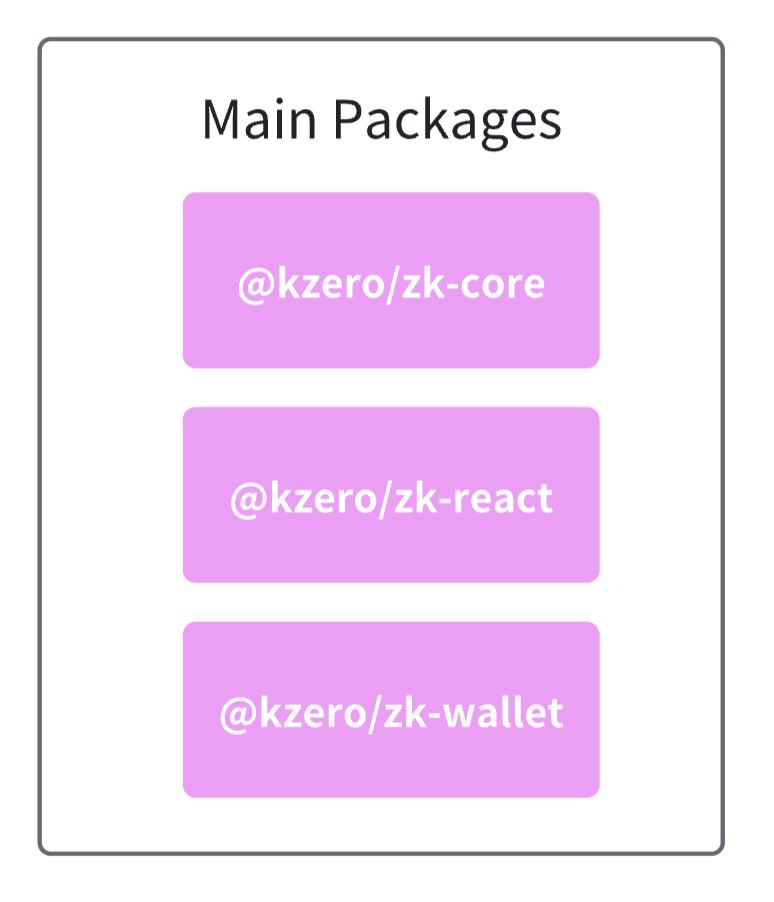
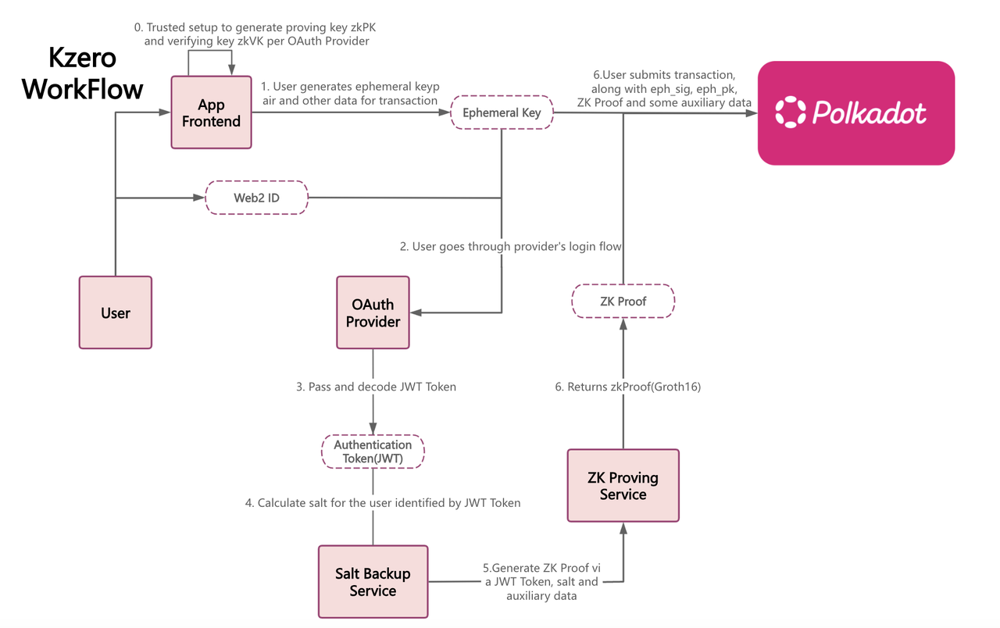

# KZero Wallet SDK - Technical Documentation

## Overview

The KZero Wallet is a comprehensive zero-knowledge (ZK) wallet SDK that enables seamless integration of Web2 authentication and transaction constructing and signing capabilities into web3 applications. Built on top of Polkadot's ecosystem, it provides a secure, user-friendly interface for managing ZK accounts and signing blockchain transactions.

The SDK leverages zero-knowledge proofs to enable users to authenticate using their social media accounts while maintaining privacy and security. This approach eliminates the need for traditional seed phrases while providing cryptographic security guarantees.



## Architecture

The SDK consists of three main packages working together to provide a complete wallet solution:

### Package Structure

```
@kzero/zk-core     - Provides the foundational ZK proof generation, account management, and type definitions
@kzero/zk-react    - Offers React-specific components, hooks, and theming system for UI integration
@kzero/zk-wallet   - Handles message communication, cryptographic operations, and key management
```

### External Dependencies
- **Polkadot API**: For blockchain interaction and transaction signing
- **Social Providers**: OAuth2/OpenID Connect integration with major platforms
- **Cryptographic Libraries**: Ed25519, Blake2, NaCl for secure operations

## Key Features

### 1. Zero-Knowledge Authentication

The SDK implements a sophisticated zero-knowledge authentication system that allows users to prove their identity without revealing sensitive information.



#### Social Login Integration
- **Supported Providers**: Google, Twitter, Apple, GitHub, etc.
- **OAuth2/OpenID Connect**: Industry-standard authentication protocols
- **Seamless Integration**: One-click login experience


#### ZK Proof Generation
- **Privacy-Preserving**: Users can authenticate without revealing personal data
- **Cryptographic Security**: Mathematical guarantees of identity verification
- **Automatic Generation**: Proofs are generated server-side and delivered securely

#### Ephemeral Key Management
- **Temporary Keypairs**: Generated locally for each session
- **Secure Storage**: Encrypted storage with user-controlled passphrases
- **Automatic Cleanup**: Keys are destroyed after session expiration

### 2. Account Management

Comprehensive account lifecycle management with real-time status tracking.

#### Account Status Tracking
- **Pending**: Initial authentication state
- **Encrypting**: Key encryption in progress
- **Ready**: Account fully operational

#### Proof Status Management
- **Pending**: ZK proof generation in progress
- **Generated**: Proof successfully created
- **Error**: Proof generation failed

### 3. Transaction Signing

Advanced transaction signing capabilities with Polkadot/Substrate integration.

#### Polkadot Integration
- **Full Compatibility**: Native support for Polkadot and Substrate networks
- **Runtime Compatibility**: Automatic adaptation to different runtime versions
- **Network Agnostic**: Works across multiple Polkadot parachains
- **Encrypted Keys**: Uses encrypted ephemeral keys for signing

## Installation & Setup

### Prerequisites

- **Node.js**: Version 20 or higher
- **Package Manager**: pnpm (recommended) or npm
- **Browser**: Modern browser with WebAssembly support
## Quick Start

### Prerequisites

- **Node.js** >= 20
- **pnpm** (recommended package manager)

### Installation

```bash
# Install dependencies
pnpm install

# Build all packages
pnpm build
```

### Development

**Start package development (watch mode):**
```bash
pnpm dev
```

**Start wallet application (port 5176):**
```bash
pnpm dev:wallet
```

**Start playground example (port 5175):**
```bash
pnpm dev:playground
```

**Start everything:**
```bash
pnpm dev:all
```

### Integration Example

```tsx
import { KzeroProvider, useKzero } from '@kzero/zk-react';

function App() {
  return (
    <KzeroProvider
      walletUrl="http://localhost:5176"
      rpcUrl="ws://127.0.0.1:9944"
      authEndpoint="http://localhost:3000"
      displayMode="modal"
    >
      <YourDApp />
    </KzeroProvider>
  );
}

function YourDApp() {
  const { account, isConnected, connect, sendTransaction } = useKzero();

  if (!isConnected) {
    return <button onClick={connect}>Connect Wallet</button>;
  }

  return (
    <div>
      <p>Connected: {account?.address}</p>
      <button onClick={() => sendTransaction(txPayload)}>
        Send Transaction
      </button>
    </div>
  );
}
```

See `apps/playground` for complete integration examples.


## Available Commands

### Build & Development
- `pnpm build` - Build all packages and applications
- `pnpm dev` - Start development mode for core packages
- `pnpm dev:wallet` - Start wallet application (port 5176)
- `pnpm dev:playground` - Start playground example (port 5175)
- `pnpm dev:all` - Start all services concurrently

### Testing & Quality
- `pnpm test` - Run all tests
- `pnpm test:watch` - Run tests in watch mode
- `pnpm test:cov` - Generate coverage reports
- `pnpm lint` - Run ESLint
- `pnpm check-types` - Run TypeScript type checking
> To find more details about the testing, please check [kzero-wallet-test-guide.md](https://github.com/kzero-xyz/kzero-grant-docs/blob/main/kzero-wallet-test-guide.md)
### Other
- `pnpm commit` - Create conventional commit with Commitizen

## Technology Stack

### Frontend
- **React 19** - UI library
- **TypeScript 5.9** - Type system
- **Vite 7** - Build tool
- **Tailwind CSS 4** - Styling (Wallet)
- **Material-UI 6** - UI components (Playground)
- **TanStack Router** - File-based routing (Wallet)

### Blockchain
- **Polkadot API** - Blockchain interaction
- **@polkadot/util-crypto** - Cryptographic utilities

### Security & Encryption
- **@noble/ciphers** - XChaCha20-Poly1305 encryption
- **@noble/hashes** - PBKDF2 key derivation

### Testing & Quality
- **Vitest** - Test framework
- **@testing-library/react** - Component testing
- **ESLint 9** - Code linting
- **Husky** - Git hooks

### Build & Tooling
- **pnpm** - Package manager
- **Turbo** - Monorepo build system
- **Rollup** - Library bundling

## Package Documentation

Each package has its own detailed README:

- **[@kzero/zk-core](packages/zk-core/README.md)** - Core types and ZK proof utilities
- **[@kzero/message-port](packages/message-port/README.md)** - Type-safe iframe communication
- **[@kzero/zk-react](packages/zk-react/README.md)** - React integration SDK

## Application Documentation

- **[Wallet App](apps/wallet/README.md)** - Official wallet implementation
- **[Playground](apps/playground/README.md)** - SDK integration examples

## How It Works

### 1. Authentication Flow

```
User clicks OAuth provider
     ↓
Generate ephemeral keypair (Ed25519)
     ↓
Request auth URL from backend
     ↓
Open OAuth window → User authorizes
     ↓
Backend receives JWT → Generates ZK proof
     ↓
Wallet polls for proof status
     ↓
Derive zkAddress from proof
     ↓
User sets PIN → Encrypt keypair
     ↓
Account ready for signing
```

### 2. Communication Architecture

```
DApp (Parent Window)          Wallet (Iframe)
┌─────────────────┐           ┌─────────────────┐
│ BidirectionalPort│◄─Channel─►│ BidirectionalPort│
│ • request()     │           │ • request()     │
│ • emit()        │           │ • emit()        │
│ • on()          │           │ • on()          │
└─────────────────┘           └─────────────────┘
```

- **Request/Response**: Async operations (signing, account queries)
- **Events**: State updates (account changes, theme updates)
- **Type Safety**: Full TypeScript type inference across both sides

### 3. Transaction Signing

```
DApp sends sign request
     ↓
Wallet displays transaction details
     ↓
User enters PIN → Decrypt keypair
     ↓
Sign with ephemeralPrivateKey
     ↓
Return { signature, signedTransaction }
     ↓
DApp submits to blockchain
```

## Security Features

- **Zero-Knowledge Proofs** - OAuth JWT never exposed to DApp
- **Ephemeral Keypairs** - Temporary keys for each session
- **PIN Encryption** - PBKDF2 (100k iterations) + XChaCha20-Poly1305
- **Origin Verification** - All postMessage calls verify origin
- **Session Isolation** - Keys stored in sessionStorage (tab-scoped)

## Development Notes

### Building Packages

Packages must be built before running applications:

```bash
pnpm build
```

### Running Tests

Each package has its own test suite:

```bash
# Run all tests
pnpm test

# Run tests for specific package
pnpm --filter @kzero/message-port test

# Watch mode
pnpm test:watch
```

### Type Checking

```bash
# Check all packages
pnpm check-types

# Check specific package
pnpm --filter @kzero/zk-react check-types
```

## License

GPL-3.0

## Support

For technical support and questions:

- **GitHub Issues**: [https://github.com/kzero-xyz/kzero-wallet/issues](https://github.com/kzero-xyz/kzero-wallet/issues)
- **Github Repo**: [https://github.com/kzero-xyz/kzero-wallet](https://github.com/kzero-xyz/kzero-wallet)

---

*This technical documentation provides comprehensive coverage of the KZero Wallet SDK. For additional resources and advanced usage patterns, please refer to the individual package documentation and examples.*